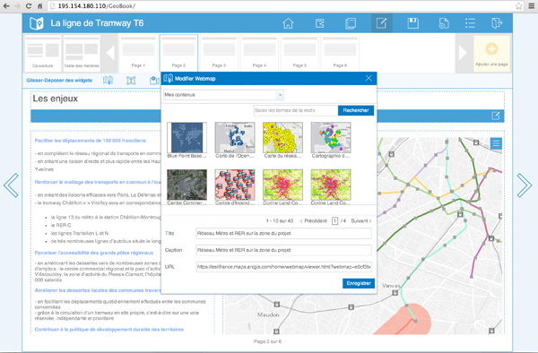

# GeoBook

Le générateur de "GeoBook" est une application ArcGIS JavaScript qui permet aux utilisateurs de construire une présentation exposant des contenus interatifs dont des cartes web ArcGIS Online (ou Portal for ArcGIS).

Cette application peut être déployée par toutes les organisations pour publier des documents dynamiques et interactifs pour les décideurs, vos collaborateurs, vos partenaires ou même le grand public. 

Les GeoBooks peuvent contenir des cartes web ArcGIS, des videos, des photos, des textes riches. Vos GeoBooks sont stockés sur la plateforme ArcGIS Online (ou Portal for ArcGIS) de votre organisation. Comme avec n'mporte quelle autre ressource de votre portail, vos GeoBooks peuvent être privés, partagés avec différents membres de votre organisation ou patagés publiquement. Vos livres cartographiques s'affichent dans un navigateur aussi bien sur des postes Desktop que sur des tablettes.

Le projet "GeoBook" est une version française du projet d'Esri ["Briefing-book"](https://github.com/Esri/briefing-book) traduit et adapté par Gaëtan LAVENU (Esri France).

[Consulter un exemple de GeoBook](http://195.154.180.110/GeoBook/default.htm)

## Fonctionnalités

* Créer une présentation incluant des cartes web ArcGIS, des vidéos, des photos et des textes riches
* Partager votre présentation avec différents utilisateurs ou de manière publique 

## Instructions

### Aide générale sur l'utilisation de GitHub
[Vous découvrez Github? Quelques instructions (en anglais) pour apprendre les bases:](http://htmlpreview.github.com/?https://github.com/Esri/esri.github.com/blob/master/help/esri-getting-to-know-github.html)

### Installer et configurer l'application GeoBook

Pour commencer, vous devez installer puis configurer l'application. Cela ne vous prendra que quelques minutes
en suivant les instructions figurant dans [cette page](INSTALLER_CONFIGURER.md).

### Contribuer

Esri France vous encourage à modifier, améliorer ou étendre cette application. Pour plus d'information, 
consulter [ce guide de contribution](https://github.com/esrifrance/Contribuer).

### Conditions de Licence

Copyright 2013 Esri / Esri France

Cette application est publiée sous licence: "Apache License, Version 2.0".
Vous ne devez pas utiliser les fichiers de ce projet en dehors des clauses de cette Licence.
Les clauses de cette licence sont détaillées ici:

   http://www.apache.org/licenses/LICENSE-2.0

Vous devez également prendre en compte les notes suivantes:

"Unless required by applicable law or agreed to in writing, software
distributed under the License is distributed on an "AS IS" BASIS,
WITHOUT WARRANTIES OR CONDITIONS OF ANY KIND, either express or implied.
See the License for the specific language governing permissions and
limitations under the License."

Une copie des clauses de la licence Apache Version 2.0 se trouve à la racine de ce projet GitHub (dans sa version originale anglaise)
[LICENSE.txt](LICENSE.txt).
